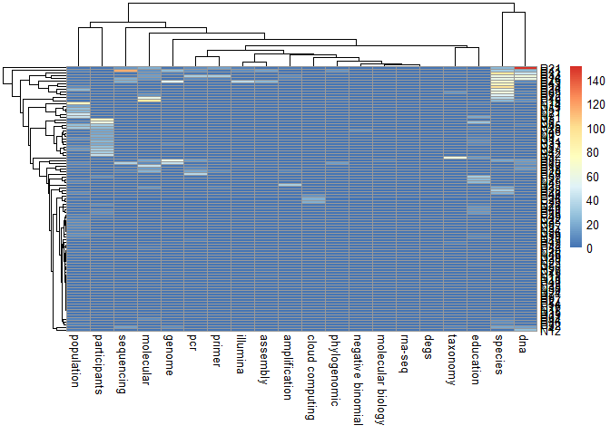
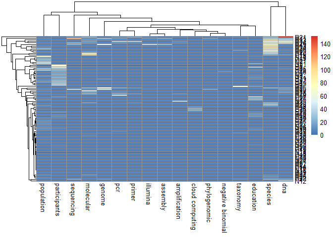

# Before You Start

1.  Set up the folder and file system with pdf in Positive and Negative

# Chapters

1.  Set up the path for both positive and negative folder  
2.  Set up all keywords  
3.  Create a Word Count matrix of correct dimensions  
4.  Loop through all pdf files and count the keywords of each files one
    by one  
5.  Export the word Count as data frame  
6.  Using SVM for classification  
7.  Using Neural Network for classification  
8.  Using Logistic regression for classification  
9.  Test model on new data

# Setup Work Directory and List down all Pdf in the folder as a List Object

``` r
getwd()
```

    ## [1] "D:/Users/Documents/GitHub/Text-Mining-With-R/Text-Mining-With-R"

``` r
PositiveFiles <- paste0("./Positive/",list.files(path = "./Positive",pattern = ".pdf"))
NegativeFiles <- paste0("./Negative/",list.files(path = "./Negative",pattern = ".pdf"))
files <- c(PositiveFiles,NegativeFiles)

files
```

    ##  [1] "./Positive/journal.pone.0252003.pdf" "./Positive/journal.pone.0253080.pdf"
    ##  [3] "./Positive/journal.pone.0254293.pdf" "./Positive/journal.pone.0255083.pdf"
    ##  [5] "./Positive/journal.pone.0255531.pdf" "./Positive/journal.pone.0255674.pdf"
    ##  [7] "./Positive/journal.pone.0255874.pdf" "./Positive/journal.pone.0256329.pdf"
    ##  [9] "./Positive/journal.pone.0256579.pdf" "./Positive/journal.pone.0256679.pdf"
    ## [11] "./Positive/journal.pone.0256861.pdf" "./Positive/journal.pone.0256989.pdf"
    ## [13] "./Positive/journal.pone.0257209.pdf" "./Positive/journal.pone.0257243.pdf"
    ## [15] "./Positive/journal.pone.0257338.pdf" "./Positive/journal.pone.0257362.pdf"
    ## [17] "./Positive/journal.pone.0257392.pdf" "./Positive/journal.pone.0257419.pdf"
    ## [19] "./Positive/journal.pone.0257445.pdf" "./Positive/journal.pone.0257460.pdf"
    ## [21] "./Positive/journal.pone.0257510.pdf" "./Positive/journal.pone.0257519.pdf"
    ## [23] "./Positive/journal.pone.0257572.pdf" "./Positive/journal.pone.0257575.pdf"
    ## [25] "./Positive/journal.pone.0257582.pdf" "./Positive/journal.pone.0257624.pdf"
    ## [27] "./Positive/journal.pone.0257642.pdf" "./Positive/journal.pone.0257803.pdf"
    ## [29] "./Positive/journal.pone.0257826.pdf" "./Positive/journal.pone.0257858.pdf"
    ## [31] "./Positive/journal.pone.0257890.pdf" "./Positive/journal.pone.0257968.pdf"
    ## [33] "./Positive/journal.pone.0258003.pdf" "./Positive/journal.pone.0258062.pdf"
    ## [35] "./Positive/journal.pone.0258081.pdf" "./Positive/journal.pone.0258148.pdf"
    ## [37] "./Positive/journal.pone.0258149.pdf" "./Positive/journal.pone.0258150.pdf"
    ## [39] "./Positive/journal.pone.0258153.pdf" "./Positive/journal.pone.0258169.pdf"
    ## [41] "./Positive/journal.pone.0258183.pdf" "./Positive/journal.pone.0258186.pdf"
    ## [43] "./Positive/journal.pone.0258193.pdf" "./Positive/journal.pone.0258198.pdf"
    ## [45] "./Positive/journal.pone.0258212.pdf" "./Positive/journal.pone.0258220.pdf"
    ## [47] "./Positive/journal.pone.0258221.pdf" "./Positive/journal.pone.0258230.pdf"
    ## [49] "./Positive/journal.pone.0258233.pdf" "./Positive/journal.pone.0258249.pdf"
    ## [51] "./Positive/journal.pone.0258267.pdf" "./Positive/journal.pone.0258273.pdf"
    ## [53] "./Positive/journal.pone.0258275.pdf" "./Positive/journal.pone.0258285.pdf"
    ## [55] "./Positive/journal.pone.0258325.pdf" "./Positive/journal.pone.0258335.pdf"
    ## [57] "./Positive/journal.pone.0258383.pdf" "./Positive/journal.pone.0258394.pdf"
    ## [59] "./Positive/journal.pone.0258395.pdf" "./Positive/journal.pone.0258402.pdf"
    ## [61] "./Positive/journal.pone.0258567.pdf" "./Negative/journal.pone.0255231.pdf"
    ## [63] "./Negative/journal.pone.0255281.pdf" "./Negative/journal.pone.0255491.pdf"
    ## [65] "./Negative/journal.pone.0256136.pdf" "./Negative/journal.pone.0256159.pdf"
    ## [67] "./Negative/journal.pone.0256431.pdf" "./Negative/journal.pone.0256534.pdf"
    ## [69] "./Negative/journal.pone.0256567.pdf" "./Negative/journal.pone.0256575.pdf"
    ## [71] "./Negative/journal.pone.0256624.pdf" "./Negative/journal.pone.0256675.pdf"
    ## [73] "./Negative/journal.pone.0256683.pdf" "./Negative/journal.pone.0256710.pdf"
    ## [75] "./Negative/journal.pone.0256737.pdf" "./Negative/journal.pone.0256764.pdf"
    ## [77] "./Negative/journal.pone.0256837.pdf" "./Negative/journal.pone.0256881.pdf"
    ## [79] "./Negative/journal.pone.0256922.pdf" "./Negative/journal.pone.0256968.pdf"
    ## [81] "./Negative/journal.pone.0257101.pdf" "./Negative/journal.pone.0257246.pdf"
    ## [83] "./Negative/journal.pone.0257277.pdf" "./Negative/journal.pone.0257399.pdf"
    ## [85] "./Negative/journal.pone.0257412.pdf" "./Negative/journal.pone.0257428.pdf"
    ## [87] "./Negative/journal.pone.0257451.pdf" "./Negative/journal.pone.0257505.pdf"
    ## [89] "./Negative/journal.pone.0257539.pdf" "./Negative/journal.pone.0257631.pdf"
    ## [91] "./Negative/journal.pone.0257665.pdf" "./Negative/journal.pone.0257757.pdf"
    ## [93] "./Negative/journal.pone.0257912.pdf" "./Negative/journal.pone.0257954.pdf"
    ## [95] "./Negative/journal.pone.0257988.pdf" "./Negative/journal.pone.0258070.pdf"
    ## [97] "./Negative/journal.pone.0258405.pdf"

# List All Keywords as Another List Object

``` r
keywords <-
  c(
    "taxonomy",
    "pcr",
    "amplification",
    "primer",
    "molecular",
    "cloud computing ",
    "phylogenomic",
    "genome",
    "illumina",
    "assembly",
    "species",
    "negative binomial",
    "molecular biology",
    "dna",
    "rna-seq",
    "degs",
    "sequencing",
    "population",
    "education",
    "participants"
    
  )
head(keywords)
```

    ## [1] "taxonomy"         "pcr"              "amplification"    "primer"          
    ## [5] "molecular"        "cloud computing "

# Import Libaries

``` r
library(dplyr)
```

    ## 
    ## Attaching package: 'dplyr'

    ## The following objects are masked from 'package:stats':
    ## 
    ##     filter, lag

    ## The following objects are masked from 'package:base':
    ## 
    ##     intersect, setdiff, setequal, union

``` r
library(stringr)
library(pdftools)
```

    ## Using poppler version 21.04.0

# Create Starting Word Count Matrix of Correct Dimenstions

``` r
filelength <- length(files)
wordlength <- length(keywords)
word_count <- seq(1,filelength*wordlength)
dim(word_count) <- c(filelength,wordlength)

head(word_count)
```

    ##      [,1] [,2] [,3] [,4] [,5] [,6] [,7] [,8] [,9] [,10] [,11] [,12] [,13] [,14]
    ## [1,]    1   98  195  292  389  486  583  680  777   874   971  1068  1165  1262
    ## [2,]    2   99  196  293  390  487  584  681  778   875   972  1069  1166  1263
    ## [3,]    3  100  197  294  391  488  585  682  779   876   973  1070  1167  1264
    ## [4,]    4  101  198  295  392  489  586  683  780   877   974  1071  1168  1265
    ## [5,]    5  102  199  296  393  490  587  684  781   878   975  1072  1169  1266
    ## [6,]    6  103  200  297  394  491  588  685  782   879   976  1073  1170  1267
    ##      [,15] [,16] [,17] [,18] [,19] [,20]
    ## [1,]  1359  1456  1553  1650  1747  1844
    ## [2,]  1360  1457  1554  1651  1748  1845
    ## [3,]  1361  1458  1555  1652  1749  1846
    ## [4,]  1362  1459  1556  1653  1750  1847
    ## [5,]  1363  1460  1557  1654  1751  1848
    ## [6,]  1364  1461  1558  1655  1752  1849

# Loop Through All Pdf Files and Count the Keywords In A Loop

``` r
for (j in 1:length(files)) {
  P1 <- pdftools::pdf_text(pdf = files[j]) %>%
    str_to_lower() %>%
    str_replace_all("\\t", "") %>%
    str_replace_all("\n", " ") %>%
    str_replace_all("      ", " ") %>%
    str_replace_all("    ", " ") %>%
    str_replace_all("   ", " ") %>%
    str_replace_all("  ", " ") %>%
    str_replace_all("[:digit:]", "") %>%
    str_replace_all("[:punct:]", "") %>%
    str_trim()
  
  for (i in 1:length(keywords)) {
    word_count[j,i] <- P1 %>% str_count(keywords[i]) %>% sum()
  }
  
}

head(word_count)
```

    ##      [,1] [,2] [,3] [,4] [,5] [,6] [,7] [,8] [,9] [,10] [,11] [,12] [,13] [,14]
    ## [1,]   61    0    0    0    0    0    0    0    0     0     0     0     0     0
    ## [2,]    0    0    0    0    0    0    0    0    0     0     1     0     0     1
    ## [3,]    0    2    1    5   12    0    0    1    0     0    19     0     0     3
    ## [4,]    6    1    2    3    3    0    0    9    3     0    17     0     0    16
    ## [5,]    0    0    0    0    0    0    0    0    0     0     0     0     0     0
    ## [6,]   11    0    0    0    5    0    0    0    0     0    62     0     0     6
    ##      [,15] [,16] [,17] [,18] [,19] [,20]
    ## [1,]     0     0     0     1    13     2
    ## [2,]     0     0     0     8     0     0
    ## [3,]     0     0     1     1     2     0
    ## [4,]     0     0    15     0     0     0
    ## [5,]     0     0     0     0     0    73
    ## [6,]     0     0     0     0     1     0

# Export The Word Count as Dataframe

``` r
word_matrix <- as.data.frame(word_count)

SeqPos <- paste0("P",seq(1,length(PositiveFiles)))
SeqNeg <- paste0("N",seq(1,length(NegativeFiles)))
SeqName <- c(SeqPos,SeqNeg)

rownames(word_matrix) <- SeqName
colnames(word_matrix) <- keywords

Label <- c(rep("Positive",length(PositiveFiles)),rep("Negative",length(NegativeFiles)))
Label
```

    ##  [1] "Positive" "Positive" "Positive" "Positive" "Positive" "Positive"
    ##  [7] "Positive" "Positive" "Positive" "Positive" "Positive" "Positive"
    ## [13] "Positive" "Positive" "Positive" "Positive" "Positive" "Positive"
    ## [19] "Positive" "Positive" "Positive" "Positive" "Positive" "Positive"
    ## [25] "Positive" "Positive" "Positive" "Positive" "Positive" "Positive"
    ## [31] "Positive" "Positive" "Positive" "Positive" "Positive" "Positive"
    ## [37] "Positive" "Positive" "Positive" "Positive" "Positive" "Positive"
    ## [43] "Positive" "Positive" "Positive" "Positive" "Positive" "Positive"
    ## [49] "Positive" "Positive" "Positive" "Positive" "Positive" "Positive"
    ## [55] "Positive" "Positive" "Positive" "Positive" "Positive" "Positive"
    ## [61] "Positive" "Negative" "Negative" "Negative" "Negative" "Negative"
    ## [67] "Negative" "Negative" "Negative" "Negative" "Negative" "Negative"
    ## [73] "Negative" "Negative" "Negative" "Negative" "Negative" "Negative"
    ## [79] "Negative" "Negative" "Negative" "Negative" "Negative" "Negative"
    ## [85] "Negative" "Negative" "Negative" "Negative" "Negative" "Negative"
    ## [91] "Negative" "Negative" "Negative" "Negative" "Negative" "Negative"
    ## [97] "Negative"

# Visualized the Word Count Matrix

``` r
library(pheatmap)
pheatmap(word_matrix)
```

<!-- -->

# Visualized the Word Count Matrix After Keyword Filtering

``` r
indices <- colSums(word_matrix) > 10

word_matrix2 <- word_matrix[,indices]
pheatmap(word_matrix2)
```

<!-- -->

# USing SVM for Classification

``` r
library(e1071)

svm_x <- word_matrix2
svm_y <- as.factor(Label)
dat <- as.data.frame(cbind(svm_x,svm_y))

svm_model = svm(svm_y ~ ., data = dat, kernel = "linear", cost = 10, scale = FALSE)

svm_pred <- predict(svm_x, object = svm_model)

caret::confusionMatrix(svm_pred, svm_y)
```

    ## Confusion Matrix and Statistics
    ## 
    ##           Reference
    ## Prediction Negative Positive
    ##   Negative       33       17
    ##   Positive        3       44
    ##                                           
    ##                Accuracy : 0.7938          
    ##                  95% CI : (0.6997, 0.8693)
    ##     No Information Rate : 0.6289          
    ##     P-Value [Acc > NIR] : 0.0003538       
    ##                                           
    ##                   Kappa : 0.5909          
    ##                                           
    ##  Mcnemar's Test P-Value : 0.0036504       
    ##                                           
    ##             Sensitivity : 0.9167          
    ##             Specificity : 0.7213          
    ##          Pos Pred Value : 0.6600          
    ##          Neg Pred Value : 0.9362          
    ##              Prevalence : 0.3711          
    ##          Detection Rate : 0.3402          
    ##    Detection Prevalence : 0.5155          
    ##       Balanced Accuracy : 0.8190          
    ##                                           
    ##        'Positive' Class : Negative        
    ## 

# Using Logistic Regression

``` r
library(glmnet)
```

    ## Loading required package: Matrix

    ## Loaded glmnet 4.1-2

``` r
glmmodel<-glm(svm_y~., family = binomial(), data=dat)
```

    ## Warning: glm.fit: fitted probabilities numerically 0 or 1 occurred

``` r
glmprop <- predict(svm_x,object=glmmodel)

glm.pred <- ifelse(glmprop > 0.5, "Positive", "Negative")

glm.pred <- as.factor(glm.pred)
glm_y <- as.factor(Label)

glm_cm <-caret::confusionMatrix(glm.pred, glm_y)

glm_cm$table
```

    ##           Reference
    ## Prediction Negative Positive
    ##   Negative       10        4
    ##   Positive       26       57

``` r
#https://www.statology.org/glm-fit-fitted-probabilities-numerically-0-or-1-occurred/
```

# Create Neural Network in Keras

``` r
###Create neural network
library(tensorflow)
library(keras)

copydata <- function(array,n)
    {
    for(i in 1:n){array <- rbind(array,array)}
    return(array)
}

train_data <- word_matrix2 %>% unlist()
dim(train_data) <- dim(word_matrix2)

train_data <- train_data %>% copydata(5)
# Convert labels to categorical one-hot encoding
y <- as.numeric(as.factor(Label)) -1 

train_label <- to_categorical(y,num_classes = 2)
train_label <- train_label %>% copydata(5)
```

# Define NN Model in Keras

``` r
model <- keras_model_sequential() %>% 
  layer_dense(units = 28, activation = "sigmoid", input_shape = c(ncol(train_data))) %>% 
  layer_dense(units = 56, activation = "sigmoid") %>% 
  layer_dense(units = 28, activation = "sigmoid") %>% 
  layer_dense(units = 14, activation = "sigmoid") %>%
  layer_dense(units = 2, activation = "softmax")

summary(model)
```

    ## Model: "sequential"
    ## ________________________________________________________________________________
    ## Layer (type)                        Output Shape                    Param #     
    ## ================================================================================
    ## dense_4 (Dense)                     (None, 28)                      504         
    ## ________________________________________________________________________________
    ## dense_3 (Dense)                     (None, 56)                      1624        
    ## ________________________________________________________________________________
    ## dense_2 (Dense)                     (None, 28)                      1596        
    ## ________________________________________________________________________________
    ## dense_1 (Dense)                     (None, 14)                      406         
    ## ________________________________________________________________________________
    ## dense (Dense)                       (None, 2)                       30          
    ## ================================================================================
    ## Total params: 4,160
    ## Trainable params: 4,160
    ## Non-trainable params: 0
    ## ________________________________________________________________________________

``` r
model %>% compile(
  optimizer = 'rmsprop',
  loss = 'categorical_crossentropy',
  metrics = c('accuracy')
)
```

# Train Neural Network

``` r
history <- model %>% 
  fit(
    x = train_data, y = train_label,
    epochs = 20,
    use_multiprocessing=TRUE,
    batch_size = 20
  )
```

# Test Newly Created Neural Network Using Testing data

``` r
TestFiles <- paste0("./Test/",list.files(path = "./Test",pattern = ".pdf"))
TestFiles
```

    ## [1] "./Test/Negative (1).pdf" "./Test/Negative (2).pdf"
    ## [3] "./Test/Negative (3).pdf" "./Test/Positive (1).pdf"
    ## [5] "./Test/Positive (2).pdf" "./Test/Positive (3).pdf"

``` r
filelength <- length(TestFiles)
wordlength <- length(keywords)

word_count_test <- matrix(nrow = filelength,ncol = wordlength)

for (j in 1:length(TestFiles)) {
  P1 <- pdftools::pdf_text(pdf = TestFiles[j]) %>%
    str_to_lower() %>%
    str_replace_all("\\t", "") %>%
    str_replace_all("\n", " ") %>%
    str_replace_all("      ", " ") %>%
    str_replace_all("    ", " ") %>%
    str_replace_all("   ", " ") %>%
    str_replace_all("  ", " ") %>%
    str_replace_all("[:digit:]", "") %>%
    str_replace_all("[:punct:]", "") %>%
    str_trim()
  
  for (i in 1:length(keywords)) {
    word_count_test[j,i] <- P1 %>% str_count(keywords[i]) %>% sum()
  }
  
}

word_matrix_test <- as.data.frame(word_count_test)

rownames(word_matrix_test) <- TestFiles
colnames(word_matrix_test) <- keywords

label_test <- c("Negative","Negative","Negative","Positive","Positive","Positive")
y <- as.factor(label_test)

x <- unlist(word_matrix_test[,indices])
dim(x) <- c(filelength,ncol(word_matrix2))
```

#Predict Outcome of Testing Documents Against Ground Truth

``` r
NN_prediction <- predict(model,x=x)
NN_prediction <- round(NN_prediction)

NN_outcome <- c()
for(i in 1:nrow(NN_prediction)){
  
  if(NN_prediction[i,1]){
  NN_outcome <- c(NN_outcome,"Negative")
  }else
  {NN_outcome <- c(NN_outcome,"Positive")
  }
}

NN_outcome <- as.factor(NN_outcome)

cm <- caret::confusionMatrix(NN_outcome, y)
cm$table
```

    ##           Reference
    ## Prediction Negative Positive
    ##   Negative        3        0
    ##   Positive        0        3

# Which Articles Do I Read?

``` r
colnames(NN_prediction) <- c("Negative","Positive")
rownames(NN_prediction) <- TestFiles

NN_results <- NN_prediction[NN_prediction[,2]==1,]
NN_results
```

    ##                         Negative Positive
    ## ./Test/Positive (1).pdf        0        1
    ## ./Test/Positive (2).pdf        0        1
    ## ./Test/Positive (3).pdf        0        1
